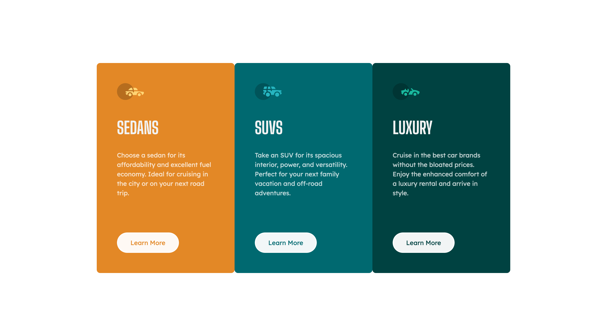

# Frontend Mentor - 3-column preview card component solution

This is a solution to the [3-column preview card component challenge on Frontend Mentor](https://www.frontendmentor.io/challenges/3column-preview-card-component-pH92eAR2-). Frontend Mentor challenges help you improve your coding skills by building realistic projects.

## Table of contents

- [Overview](#overview)
  - [The challenge](#the-challenge)
  - [Self assigned challenges](#self-assigned-challenges)
  - [Screenshot](#screenshot)
  - [Links](#links)
- [My process](#my-process)
  - [Built with](#built-with)
  - [What I learned](#what-i-learned)
  - [Useful resources](#useful-resources)
- [Author](#author)
- [Acknowledgments](#acknowledgments)

## Overview

### The challenge

Users should be able to:

- View the optimal layout depending on their device's screen size

### Self assigned challenges

- Use BEM to organise CSS.
- Try to avoid using media queries and instead just let Flexbox naturally take care of reponsive layout.
- Design the card-stack so that, if in the future more than 3 cards were required, the additional cards would just automatically style themselves rather than requiring another class such as `card-4` etc.

### Screenshot

### Links

- [Solution URL](https://www.frontendmentor.io/solutions/column-card-preview-PDLV9jHtGA)
- [Live Site URL](https://sh-column-preview-card-component.netlify.app/)

## My process

### Built with

- Semantic HTML5 markup
- CSS custom properties
- Flexbox

### What I learned

- The beauty of `mix-blend-mode` when you need text of a button to match the background behind it. Thank goodness there's across-the-range support for this.
- It's impossible to have both responsiveness taken care of by flexbox whilst simulatenously wanting a different height for flex-items at different viewport sizes.
- How to use the `nth-child` selector so that you can select child elements and give them different properties. I did this as I imagine there might be a situation where it's necessary to add additional cards to the card-stack, so I wanted to write CSS that would work in that hypothetical.

### Useful resources

- [mix-blend-mode on MDN](https://developer.mozilla.org/en-US/docs/Web/CSS/mix-blend-mode)

## Author

- Website - [Sam Hemingway](https://samhemingway.dev)
- Frontend Mentor - [@SamHemingway](https://www.frontendmentor.io/profile/samhemingway)
